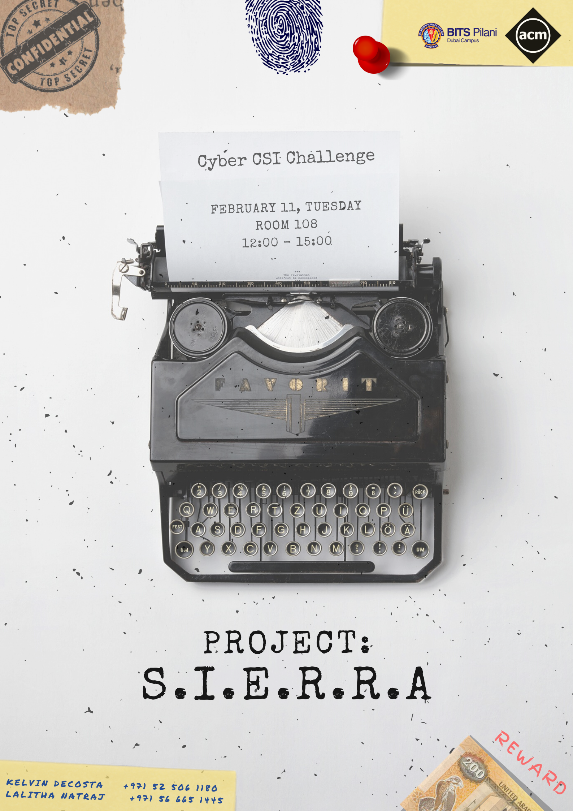

**Project: S.I.E.R.R.A.** was the very first crime scene investigation game organized by ACM.
It was a treasure hunt where participants were divided into pairs.
Each pair would have one individual working at the lab and the other looking for answers across the campus.

The event was advertised with the following poster:

A prize money of **`AED 200`** was set.

  

    
  

  

    
  

  

    
  

  

    
  

  

    
  

  

    
  

The game required a website to keep track of teams and their progress.
It was built using the [CTFd](https://ctfd.io/) platform.

Here are some pictures from the event.

The following are the results of the event:

- 1st : Team **`panda`**:
  - [Adithya T. P.](f20170199@dubai.bits-pilani.ac.in)
  - [Samreen Khan](f20160104@dubai.bits-pilani.ac.in)
- 2nd : Team **`balrajbois`**:
  - [Dhruv Duseja](f20160904@dubai.bits-pilani.ac.in)
  - [Kunal Haryani](f20170209@dubai.bits-pilani.ac.in)
- 3rd : Team **`The Dark Army`**:
  - [Parth Ganeriwala](f20180131@dubai.bits-pilani.ac.in)
  - [Ashish](f20180173@dubai.bits-pilani.ac.in)

The logs of the entire event can be found in [this database backup](assets/doc/database.zip).

At the end of the event many participants showed their appreciation for the event.
Finally, we collected [feedback](https://forms.gle/i1NBDhKK1KM8MCWC9) after the event.
